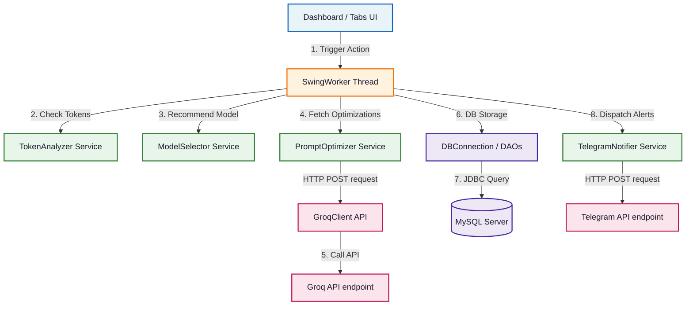
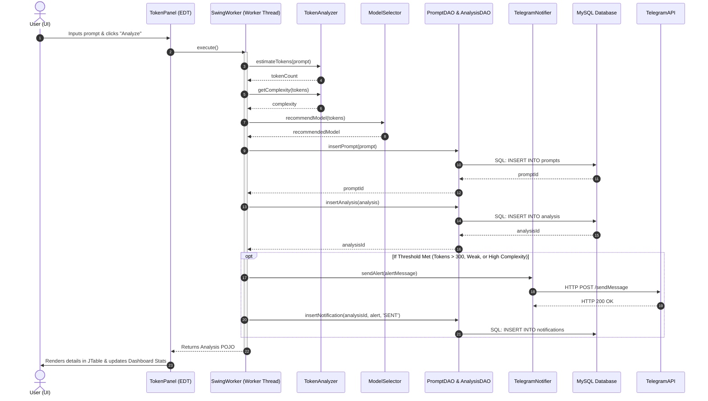

# <p align="center">🤖 Promptify — AI Credit Cost Analyzer</p>
<p align="center">
  
  
  
  
  
  
</p>

---

## 📖 Overview

**Promptify** is an enterprise-grade Java Swing desktop application designed to analyze, monitor, optimize, and log AI prompt metrics before dispatching them to LLMs. By providing local token cost estimation, model routing recommendation, shadow prompt optimization via the **Groq API**, and instant alerting through the **Telegram Bot API**, Promptify helps teams minimize API spending and prevent prompt quality degradation.

All operations are executed asynchronously off the Event Dispatch Thread (EDT) utilizing SwingWorkers, and recorded in a MySQL relational database using a pure, framework-less JDBC persistence layer.

---

## 🏗️ Architecture & Component Interaction

Promptify is built on a clean **Model-View-DAO-Service** architecture. The separation of concerns guarantees that UI panels remain light, database queries execute on background threads, and service layers are reusable.

### 1. High-Level Component Flow
The following flowchart illustrates how the Swing UI communicates with background threads, services, external endpoints, and the MySQL database. 




### 2. End-to-End Analysis Pipeline
The sequence diagram below details the step-by-step execution path when a user submits a prompt for analysis:



---

## 🛠️ Technology Stack
Promptify strictly adheres to a zero-framework dependency mandate to keep the deployment lightweight, secure, and compatible with core Java runtimes.

| Layer | Component | Details / Custom Implementations |
| :--- | :--- | :--- |
| **Frontend** | Java Swing & AWT | Customized layouts, custom JTable cell renderers, and full asynchronous SwingWorkers. |
| **Language** | Core Java | Compiled on Java 17+ (supports up to JDK 22). |
| **Database** | MySQL 8.x | Managed locally with persistent relational tables. |
| **Connection** | JDBC | Singleton connection pool pattern; no ORM or Hibernate libraries. |
| **AI Client** | HTTP / Groq API | Native JDK `HttpClient` executing POST requests, utilizing custom, state-based, character-by-character JSON parsing. |
| **Alerts** | Telegram HTTP Bot API | Native `HttpClient` with URL-encoded JSON payloads sending bot updates. |
| **Build Tool** | Scripted build pipeline | PowerShell and Shell automation configurations (no Maven/Gradle requirement). |

---

## 📂 Project Directory Structure

```directory
AICreditCostAnalyzer/
├── src/
│   ├── api/
│   │   └── GroqClient.java         # Native HTTP client querying the Groq Chat API
│   │
│   ├── database/
│   │   ├── DBConnection.java       # Thread-safe JDBC connection singleton
│   │   ├── PromptDAO.java          # CRUD mapper for prompts + optimized_prompts
│   │   └── AnalysisDAO.java        # CRUD mapper for analysis + notification logs
│   │
│   ├── model/
│   │   ├── Prompt.java             # Plain Old Java Object (POJO) representing prompts
│   │   ├── Analysis.java           # POJO representing prompt analysis metrics
│   │   └── Notification.java       # POJO representing notification status logs
│   │
│   ├── service/
│   │   ├── TokenAnalyzer.java      # Analyzes length, detects repeated words, estimates cost
│   │   ├── ModelSelector.java      # Model routing advisor based on complexity
│   │   ├── PromptOptimizer.java    # Orchestrates LLM prompt optimization requests
│   │   └── TelegramNotifier.java   # Dispatches alerts to Telegram channel or chat
│   │
│   ├── ui/
│   │   ├── DashboardFrame.java     # Main window frame containing global metrics cards
│   │   ├── TokenPanel.java         # Tab 1: Token Estimator & metrics table
│   │   ├── OptimizerPanel.java     # Tab 2: Groq-powered prompt quality optimizer
│   │   ├── ModelSwitcherPanel.java # Tab 3: Visual complexity level progress bar
│   │   └── DatabasePanel.java      # Tab 4: Tabular database browser & SQL exporter
│   │
│   └── Main.java                   # App entrypoint; verifies DB connection & spawns UI
│
├── lib/
│   └── mysql-connector-j-8.x.x.jar # MySQL JDBC driver
│
├── config.properties               # Encrypted configuration (DB credentials & API keys)
├── config.properties.example       # Blank credentials blueprint
├── schema.sql                      # DDL schema containing full database tables
├── build.ps1                       # Self-detecting PowerShell compilation script
├── run.ps1                         # Self-detecting PowerShell application launcher
├── start.ps1                       # Automation workflow (sets up MySQL, builds, runs)
└── README.md                       # Comprehensive documentation
```

---

## ⚙️ Initial Setup Guide

###  Prerequisites
* **Java Development Kit (JDK) 17 or higher**
* **MySQL Server 8.0+**
* **Active Telegram Bot Credentials**
* **Active Groq Console API Key**

---

### Step 1: Initialize Database
Execute the database setup script to generate the database schema and initialize the tables:
```bash
mysql -u root -p < schema.sql
```
This builds the `ai_analyzer` schema with cascade delete constraints and optimized timestamps.

---

### Step 2: Configure Credentials
1. Duplicate the blueprint property file:
   ```bash
   cp config.properties.example config.properties
   ```
2. Open `config.properties` in your project root and update with your credentials:
   ```properties
   db.url=jdbc:mysql://localhost:3306/ai_analyzer
   db.user=root
   db.password=your_mysql_root_password

   groq.api.key=gsk_your_groq_api_key_here
   groq.api.url=https://api.groq.com/openai/v1/chat/completions
   groq.model=llama-3.3-70b-versatile
   groq.fallback.models=llama-3.1-8b-instant

   telegram.bot.token=your_telegram_bot_token_here
   telegram.chat.id=your_telegram_chat_id_here
   ```

> [!WARNING]
> Do not commit `config.properties` to version control. It is already added to `.gitignore` to prevent leaking API keys and database passwords.

---

### Step 3: Fetch the MySQL JDBC Driver
1. Download the driver from [MySQL official repository](https://dev.mysql.com/downloads/connector/j/).
2. Place the JAR file into the `lib/` directory. (e.g. `lib/mysql-connector-j-8.3.0.jar`).

---

### Step 4: Configure Telegram Notifications (Optional)
1. Message [@BotFather](https://t.me/BotFather) on Telegram and type `/newbot` to generate a Bot Token.
2. Search for [@userinfobot](https://t.me/userinfobot) and message it to retrieve your numeric `Chat ID`.
3. Set these values in `config.properties`.

---

## 🚀 Running the Application

### The Easiest Way (PowerShell Automation)
From the root directory, execute the automated runner:
```powershell
./start.ps1
```
This will:
1. Initialize the local MySQL server daemon if not already started.
2. Compile all source files into the `/out` directory (automatically locating JDK paths).
3. Start the Java Virtual Machine running Promptify.

---

### Manual Commands

#### A. Compilation

* **Windows (PowerShell)**:
  ```powershell
  $javacCmd = "javac"
  if (-not (Get-Command javac -ErrorAction SilentlyContinue)) {
      $javacCmd = "C:\Users\venky\.p2\pool\plugins\org.eclipse.justj.openjdk.hotspot.jre.full.win32.x86_64_21.0.11.v20260515-1531\jre\bin\javac.exe"
  }
  & $javacCmd -encoding UTF-8 -cp "lib/*" -d out (Get-ChildItem -Recurse -Filter *.java src).FullName
  ```

* **Mac & Linux**:
  ```bash
  mkdir -p out
  find src -name "*.java" | xargs javac -cp "lib/*" -d out/
  ```

#### B. Execution

* **Windows**:
  ```powershell
  $javaCmd = "java"
  if (-not (Get-Command java -ErrorAction SilentlyContinue)) {
      $javaCmd = "C:\Users\venky\.p2\pool\plugins\org.eclipse.justj.openjdk.hotspot.jre.full.win32.x86_64_21.0.11.v20260515-1531\jre\bin\java.exe"
  }
  & $javaCmd -cp "out;lib/*" Main
  ```

* **Mac & Linux**:
  ```bash
  java -cp "out:lib/*" Main
  ```

---

## 📈 Terminal Activity Log Format
Every UI interaction triggers system output showing SQL tracking and HTTP statuses:

```log
========================================
  AI Credit Cost Analyzer - Starting   
========================================
[DB] Loading config from: D:\JavaDBMS\AICreditCostAnalyzer\config.properties
[DB] Connection established to: jdbc:mysql://localhost:3306/ai_analyzer
[Main] Database connection: OK
[Main] UI launched successfully.

========== STARTING ANALYSIS ==========
[App] Prompt received: Write a quicksort program in Java
[TokenAnalyzer] Action: estimateTokens - length: 33, tokens: 8
[TokenAnalyzer] Action: getComplexity - tokens: 8 -> LOW
[TokenAnalyzer] Action: getCostCategory - tokens: 8 -> Low
[TokenAnalyzer] Action: getSuggestion - tokens: 8
[ModelSelector] Action: recommendModel - tokens: 8 -> recommended: Gemini Flash
[App] Complexity: LOW
[App] Recommended Model: Gemini Flash
[App] Cost Category: Low
[SQL] Executing: INSERT INTO prompts (original_prompt) VALUES (?)
[DB] Rows inserted: 1
[SQL] Executing: INSERT INTO analysis (prompt_id, token_count, complexity, recommended_model, ... ) VALUES (?, ?, ?, ?, ?, ?)
[DB] Rows inserted: 1
[TokenAnalyzer] Action: isWeakPrompt - weak: true
[TelegramNotifier] Action: sendAlert - message: ⚠️ <b>Weak Prompt Detected</b>...
[TelegramNotifier] Status: 200
[SQL] Executing: INSERT INTO notifications (analysis_id, message, status) VALUES (?, ?, ?)
[DB] Rows inserted: 1
========== ANALYSIS COMPLETE ==========
```

---

## 🔍 Troubleshooting Guide

| Issue | Root Cause | Solution |
| :--- | :--- | :--- |
| `Database connection failed` | MySQL daemon is inactive or database does not exist. | Ensure MySQL server is running. Verify that `schema.sql` was executed. Check credentials in `config.properties`. |
| `ClassNotFoundException: com.mysql.cj.jdbc.Driver` | The JDBC driver JAR is missing from the classpath. | Verify the `mysql-connector-j-*.jar` file resides in the `lib/` directory and that the command classpath ends in `lib/*`. |
| `config.properties not found` | The application was launched from the incorrect folder. | Run `java` or script commands from the root directory `AICreditCostAnalyzer/` so that `new File("config.properties")` resolves correctly. |
| `Error: HTTP 401 (Groq API)` | The API key is invalid or lacks access permissions. | Check the `groq.api.key` entry in `config.properties` for spacing or truncation errors. |
| `Error: HTTP 429` | Groq API rate limits have been temporarily exceeded. | Wait 60 seconds and try again, or adjust `groq.fallback.models` in properties. |
| `Telegram Status: 400` | The `telegram.chat.id` is invalid or the channel has not started a chat with the bot. | Open Telegram, start a chat with the bot (`/start`), and verify the numeric Chat ID. |
| `UI freezes during LLM request` | A thread block on the Event Dispatch Thread (EDT). | Ensure all client and DAO calls are wrapped in `SwingWorkers`. Verify that `doInBackground()` handles the execution while `done()` updates the UI. |

---

## 📄 License
This project is licensed under the MIT License - see the LICENSE file for details.

---
*Created by [Venkatesh Reddy](https://github.com/VenkateshReddy007) - Software Architect and Lead Developer.*
